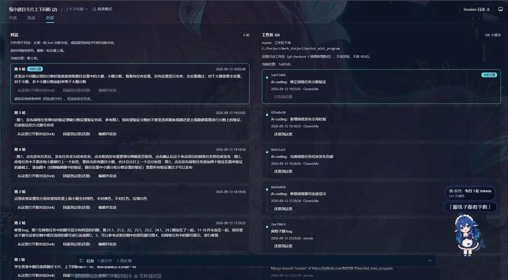
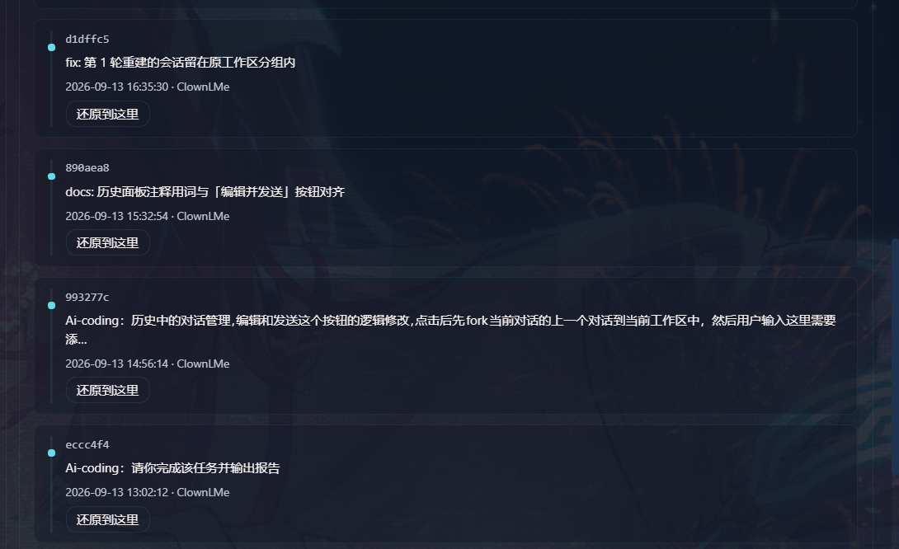
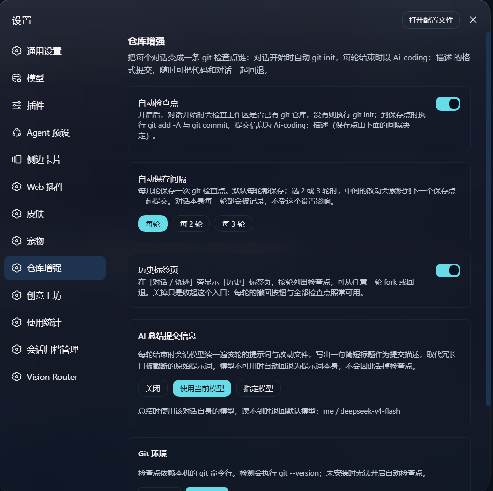
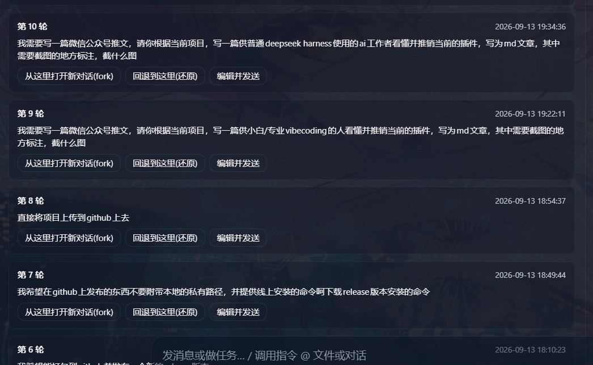
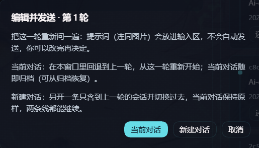
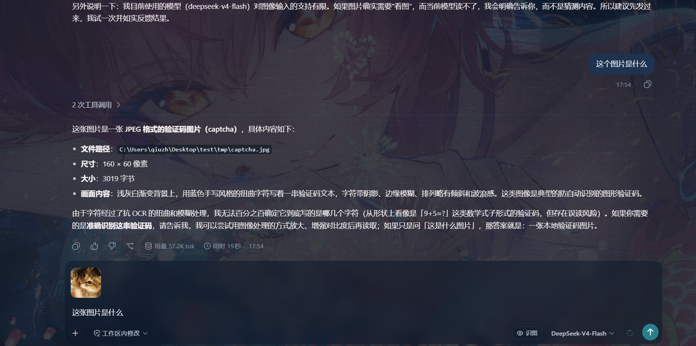

# 和 AI 忙了一下午，最怕的不是它笨，是它把你昨天弄好的那份弄没了

**—— 一个给所有 DeepSeek Harness 用户的插件：写代码的、写文档的、做日常工作的，都能自动存档，方便还原**

---

## 先说一个你可能已经历过的场景

你让 AI 帮你把一份会议纪要整理成正式格式。改得挺好，你满意地关掉了窗口。

第二天，你让它「在昨天那份基础上补一下这周的进展」。

它补了。顺便**把昨天你一句句抠出来的那几条结论，重写了一遍**。

你想退回昨天那版。然后你发现：

- 文件被改了好几个地方，你说不清哪一处是昨天定稿的；
- 聊天记录往上翻，你能看到自己说过什么，但**看不到当时那份文件长什么样**；
- 你只能凭印象再改一遍，改完还不确定是不是原来那版。

同样的事，换个活就是另一个版本：

- **简历**改到第五版，你让 AI「按这个思路再润一下」，它把前四版你谈好的措辞也一起换了；
- **给客户的方案**，你只想更新报价那一段，它顺手把整篇的章节顺序重排了；
- **整理了一下午的资料**，AI 回你「已按要求归类完成」，你翻了一遍，发现有两份不见了；
- **一份要交的表格**，你让它补一列，它把公式和格式一起改了，你连从哪一行开始错的都找不到。
- **AI写项目代码**，你只说「修一下这个空指针」，它改完顺手**把旁边三个文件也重构了**，`git diff` 一打开你眼前一黑；

为了解决上面这一痛点，我为 **DeepSeek Harness** 写了一个 **仓库增强插件（dsh-chat-git）**，不管是**写代码、写文档、整理表格、改简历、做方案、归档资料**——只要你在这个目录里干活，它都帮你一一归档。

---

## dsh-chat-git 插件能干什么？

> **它让 AI 干的每一轮「对话」和「文件」自动实时保存并统一管理**

它是 **DeepSeek Harness（DSH）** 的一个插件。装完重启，你的界面上就多两样东西：

1. 每条 AI 回复下面的图标行里，多一个**回退**按钮；
2. 标签栏里（**对话** / **轨迹** 旁边）多一个 **历史** 标签页。




---

## AI 干完活，工作区自动存档

你继续在对话框里干活，它在后面默默存档，不需要手动操作，并且自动总结存档。

- **对话一开始**，它检查你当前的工作目录有没有一个git仓库，如果没有它自己建一个。**只会在工作目录上建**，绝不会把记录写到上层那个你根本没打开过的文件夹去
- **对话结束**（AI 交付完成）时，它把这一轮的改动整体存一次档，标题长这样：

```
Ai-coding：把会议纪要整理成正式格式
Ai-coding：修复登录接口的空指针
```

这里的标题**不是**把你那句几百字的原话塞进去，而是让模型总结工作内容，当你回头看的时候，读到的是一份**工作日志**，而不是一份聊天记录导出。**写代码的人尤其吃这一口**——`git log` 里躺着的是一句句「这轮干了什么」，而不是你自己手打的一堆 `update`、`fix`、`wip`。

这里提供**一键还原**的按钮，让**不会使用 git 的小伙伴方便使用**



**它不会因为模型抽风就丢掉存档。** 当模型不可用、超时、报错，一律退化成用你的原话当标题，可以在设置中自由设置纯当对话次数，是否使用模型总结等



---

## 对话的可视化和可编辑的管理

插件记录了每一轮当前会话的每一轮对话历史，可以在任意对话点还原，分支，从新发送（也支持新开和当前会话），为 deepseek harness 提供 **可视化和可任意编辑** 的对话管理。




任意对话区域的编辑并发送，支持当前会话和fork新会话

例如：

**文档编辑场景：** 三轮之前你说「把这份材料改成正式一点的语气」，现在你想改成「改成正式语气，并且把结论提到最前面」。

**代码编写场景：** 前面你说「修一下这个空指针」，现在你想改成「修空指针，并且补一个单元测试」。



---

## 它适合谁

**适合你，如果：**

- 你用 AI 帮忙写东西、改文件、整理资料，而且**不止一次**想「回到它乱改之前」；
- **你用 AI 写代码**，想让代码和对话能一起回到某一轮，而不是只回退半截；
- 你不想学一堆命令，但**希望有人替你记着**每一步干了什么；
- 你想把一个方向**留着当岔路口**，而不是二选一删掉；
- 你手上那些反复改的文档（方案、材料、纪要、简历、表格），你希望有一个「哪一版是哪一版」的底气。

**可能不适合你，如果：**

- 你不在 DeepSeek Harness 里干活（这是 DSH 插件，不是通用工具）；
- 你的文件放在当前工作目录之外（它只管你正在干活的这个目录）；
- 你的工作目录绝对不能自动生成存档结构。

---
## 怎么装安装

**前置条件**：
安装 **deepseek harness**
安装 **git:** https://git-scm.com/install/windows。

### 方式1：从 GitHub 直接装（推荐）

```bash
dsh plugin --profile web add github:NOOB-P/dsh-chat-git
```

### 方式2：先下载 `.tgz`，再从本地装

到 [Releases](https://github.com/NOOB-P/dsh-chat-git/releases/latest) 下载 `dsh-chat-git-0.6.0.tgz`，然后：

```bash
dsh plugin --profile web add ./dsh-chat-git-0.6.0.tgz
```

### 方式3：直接跟deepseek harness说：
```
直接帮我安装 DeepSeek Harness 插件：NOOB-P/dsh-chat-git。
该插件依赖 git 命令组件，请帮我安装 git 命令组件
```

**装完（或更新后）需要重启 `dsh web`** 才会加载。

---

## 常见疑问

**Q：我不写代码，也能用吗？**
能。它不看你干的是什么活，只看你在这个目录里改了什么文件。代码、文档、表格、笔记一视同仁。

**Q：我写代码，它和 git 是什么关系？会不会和我的工作流打架？**
它是**叠加**在你的 git 之上的，不替换任何东西。你的分支、你的提交、你的远程仓库照旧；它只是在每轮对话结束时多打一个带语义标题的提交，并且额外记住「这一轮对应哪次提交」。你手动写的提交它也照读照显示。

**Q：存档标题前面为什么写着 `Ai-coding：`？**
那是标题的固定前缀，后面那句才是模型总结出来的这轮干了什么。前缀只是让这些自动存档一眼能和别的东西区分开。

**Q：回退之后，原来的对话去哪了？**
归档了，不是删了。`回退到这里(还原)` 会另开一条只到那一轮的对话并把原对话归档，可以从归档里恢复；`从这里打开新对话(fork)` 则原样保留两条线。

**Q：它会不会把我没让它管的文件删掉？**
不会。没进过存档的文件它完全不碰——那些文件不属于任何存档，删了就找不回来，所以它选择不碰。（写代码的人尤其在意这条：你那些没提交的实验代码不会被顺手清掉。）

**Q：它会不会在我电脑上乱建东西？**
它会在你的工作目录里建一个存档结构（就是 git 仓库，一个隐藏文件夹），这是它记账的地方。它**只在当前目录建**，不会往上层的文件夹里写。

**Q：重启 DSH 之后，历史还能回退吗？**
能。记录写在 `$DSH_HOME/chat-git.json` 里，不在内存里。写失败会降级成只在内存里记，不会把插件搞崩。

**Q：会不会拖慢我？**
需要额外等待是对话结束会等一次模型调用生成标题（可关闭），而且读不到模型就直接用你的原话当标题——绝不会因为模型不可用而丢存档。

**Q：我不小心点了「当前对话」，原对话还在吗？**
在。它进的是归档，可以从归档里恢复出来。这也是为什么弹窗要问你一次，而不是替你决定。

----

## 最后

如果对插件满意，记得给我的项目送上一个⭐

- GitHub：**https://github.com/NOOB-P/dsh-chat-git**

---

